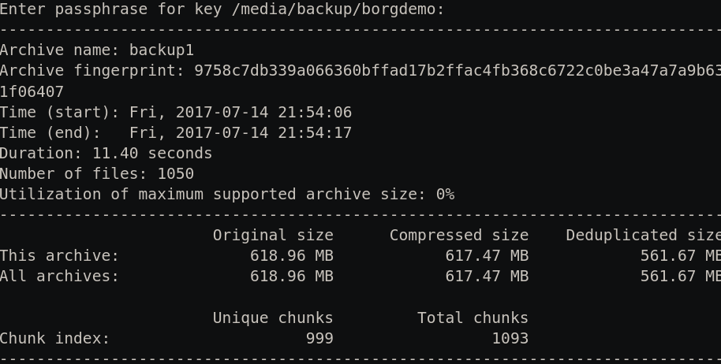

# Getting started with Borg hello
*Once Borg is set up, making a backup up takes two commands and restoring it takes two.*

> [!NOTE]
> **OS**: Borg runs on Mac and Linux, not Windows directly.
>
> Windows users, what are you still doing there?
If you really cannot migrate away from Windows, you can run Borg through WSL (Windows Subsystem for Linux): install WSL, then follow the Linux steps below inside it.
>
> **Prerequisites**: You will need the terminal; if you've never used one before, see this [brief guide](./terminal-basics.md).
It's also a good idea to go through [Creating passphrase](./creating-passphrase.md); it explains the best practices for creating secure passphrases.
>
> **Video demo**: If you prefer first watching a demo on how Borg works, see the [official demo](https://asciinema.org/a/133292?autoplay=1&speed=1.8).
> It's old but good.

## 1. Install Borg
---

**On Debian Linux**

```bash
sudo apt install borgbackup -y
```

**On macOS**

Install Homebrew:

```bash
/bin/bash -c "$(curl -fsSL https://raw.githubusercontent.com/Homebrew/install/HEAD/install.sh)"
```

When Homebrew finishes it prints a couple of lines starting with `eval` or `export` that tell you how to finish setup; copy those, paste them in, and press Enter.
Then install Borg:

```bash
brew analytics off
brew install borgbackup
```

## 2. Create the repo
---
Borg calls the backup folder a repository: an encrypted, compressed container that holds your data.
You have to do this step only once per drive unless, of course, you lose or damage your drive.

### 1.1. Get the path to your drive
Plug in your external drive or USB stick, and find the path to it.

> [!NOTE]
> **On macOS**
>
> It appears at `/Volumes/your-label`.
> To read the exact path on a Mac, open the drive in Finder, press <kbd>Cmd + Opt + C</kbd> to copy it as a pathname, and paste it anywhere; you will see something like `/Volumes/your-usb-label`; e.g. `/Volumes/backup1`.
>
> **On Linux**
>
> It usually appears at `/media/your-name/your-usb-label`; e.g. `/media/john/backup1/`.
>
> Use the path to your drive.

> [!TIP]
> If you have no spare drive, you can still test Borg by using a folder on your system, say`~/Documents`.
> The point of backing up to a drive is so that if your laptop fails or gets stolen, your backup is not lost with it.

### 1.2. Name and create the repo

Name the repo anything you like, and run the command to create the repo** (edit the path and repo name to match yours):

```bash
borg init --encryption=repokey /Volumes/backup1/borg
```

On Linux that path should look something like `/media/john/backup1/borg`, and if you are testing Borg on your system, then it would look something like `~/Documents/borg`.

### 1.3. Enter the passphrase twice

Pick a strong one.
For tips on creating a secure passphrase, see [Creating passphrase](./creating-passphrase.md).
When it asks whether to show the passphrase for verification, type `n`.

> [!CAUTION]
> Write this passphrase on paper and keep it somewhere away from the laptop.
If you lose both the passphrase and the key, your backups are gone for good, with no reset.

> [!TIP]
> That's it; that's the whole one time setup with Borg.
From here on, unless you lose your drive, it's just one command per drive to backup; and two, to restore.
>
> If you level up and start using scripts, then it's one command to backup to all your drives; and one command to restore from any one of them.
See [Levelling up]() details.

## 3. Back up
---

> [!NOTE]
> From here, every command below uses `/Volumes/backup1/borg`; replace it with your own path.

Using the terminal, navigate to the folder that contains the folder you want to back up.
Say the folder you want to backup is `mystuff` and it lives in your Documents folder, run:

```bash
cd ~/Documents
borg create -s /Volumes/backup1/borg::{now} mystuff
```

That's it.
You've successfully backed up your folder to your borg repo.
You should see something like this.

> [!NOTE]
> If you don't `cd` into Documents but run `create` with `~/Documents/mystuff`, Borg backs up the whole path such that then when you extract you will have `Documents` and inside it `mystuff`.
While if you `cd` first, then extract gives you just the folder you backed up.



`{now}` names this backup with the date and time, so each one stays separate.
If you would rather name it yourself, swap `{now}` for anything; e.g. `::archive`.
Borg requires archive names within the same repository to be unique. 
If you try to create a new archive with an existing name, Borg will fail with an error similar to: `Archive already exists: <archive-name>`.
This is by design because each archive is an immutable snapshot.

A common practice used by those who back up more than one machine use `::{hostname}-{now}` so each machine's backups are labelled and sort together; for one folder on one machine, `{now}` is all you need.

`-s` stands for stats, shown in the image above.
You may remove that if you don't care about it.

> [!NOTE]
> The first backup copies everything, so it takes a while: roughly two to three minutes for 10 GB to a fast external drive, and longer, ten minutes or more, to a cheap USB stick.
After that Borg remembers what it already saved and only adds what changed, so every backup after the first is usually done in seconds to a minute.

> [!TIP]
> Back up after every change you care about.
Next time you do not have to retype anything: plug in the drive, open the terminal, press the up arrow until the `borg create` line appears, and press Enter.

> [!IMPORTANT]
> Back up on a schedule you will actually keep, once a day or once a week, but definitely before you switch or wipe a laptop.
> 
> If you keep a second drive labelled `backup2`, set it up and backup the same way (`borg init --encryption=repokey /Volumes/backup2/borg`); just change `backup1` to `backup2` in the path.
>
> Keep one of your drives somewhere else: at work, with family, or in a safe.
Two drives in the same drawer both die in the same fire or theft; the one stored elsewhere is the one that saves you.

## 4. Restore
---

### 4.1. Select archive

```bash
borg list /Volumes/backup1/borg
```

This lists every backup you have made, newest at the bottom.
Each line starts with a timestamp like `2026-05-09T19:15:31` if you used {now} as your archive name.
You normally want the latest; older ones matter only if the newest is damaged.

Copy the archive name, which in this case is the timestamp, of the backup you want from the list.

### 4.2. Extract

Navigate to wherever you want to extract your backup; e.g. `Downloads`.
Then paste your timestamp in place of the one shown:

```bash
cd ~/Downloads
borg extract --progress /Volumes/backup1/borg::2026-05-09T19:15:31
```

You will find your `mystuff` folder; move it wherever you want it.
And that's how easy it is to use Borg.

> [!IMPORTANT]
> The first time you set this up, do this once with any backup to confirm it works.
A backup you have never restored from is only a guess.

